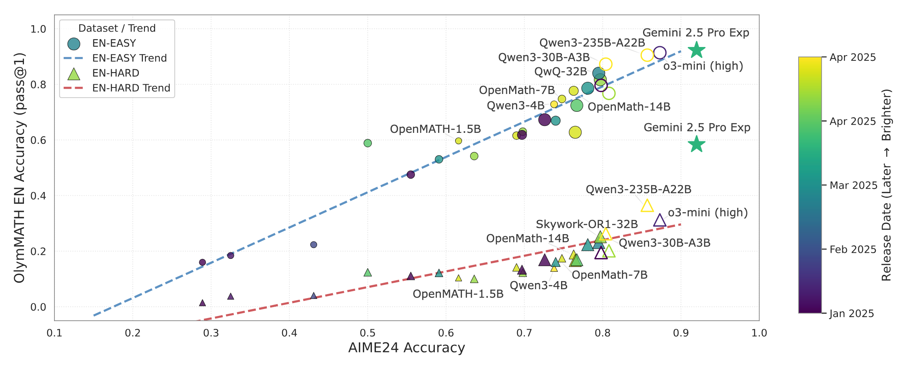
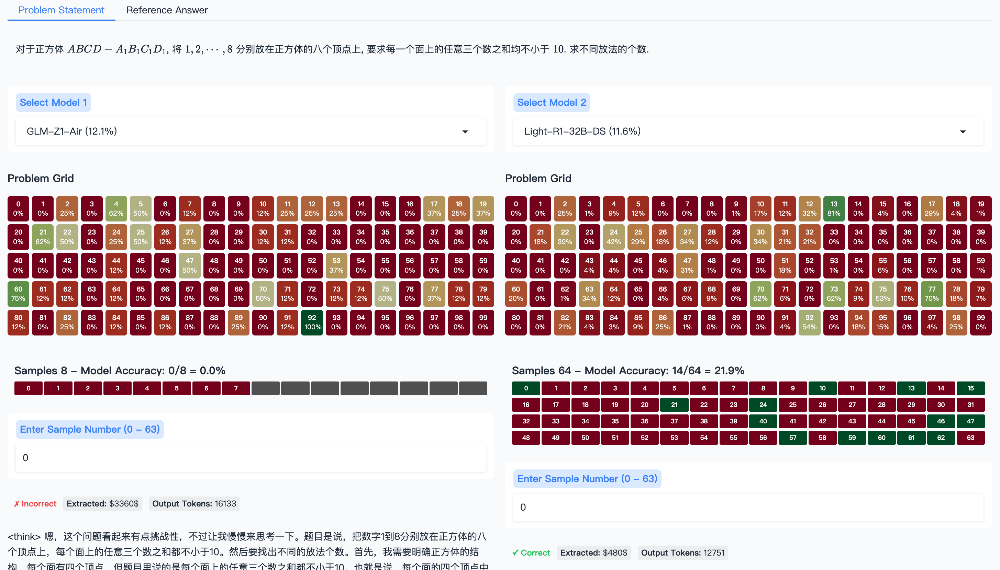

# Challenging the Boundaries of Reasoning: An Olympiad-Level Math Benchmark for Large Language Models



## News

- 2025-05-10: We have released the OlymMATH-eval dataset on [HuggingFace](https://huggingface.co/datasets/RUC-AIBOX/OlymMATH-eval) 🤗, together with a data visualization tool OlymMATH-demo, currently available in [HuggingFace Spaces](https://huggingface.co/spaces/RUC-AIBOX/OlymMATH-demo).

- 2025-03-27: We have released the OlymMATH dataset on [HuggingFace](https://huggingface.co/datasets/RUC-AIBOX/OlymMATH) 🤗 and paper is available on [arXiv](https://arxiv.org/abs/2503.21380).

---

This is the official repository for [Challenging the Boundaries of Reasoning: An Olympiad-Level Math Benchmark for Large Language Models](https://arxiv.org/abs/2503.21380) by [Haoxiang Sun](https://github.com/CoderBak), Yingqian Min, Zhipeng Chen, Wayne Xin Zhao, Lei Fang, Zheng Liu, Zhongyuan Wang, and Ji-Rong Wen.

This repo contains dataset file and evaluation code. The OlymMATH dataset is also available on [HuggingFace](https://huggingface.co/datasets/RUC-AIBOX/OlymMATH). We recommend you using this benchmark from HuggingFace considering the platform's superior flexibility.

## OlymMATH-eval Dataset

To support research into LLM reasoning, we have open-sourced the OlymMATH-eval dataset on [HuggingFace](https://hf.co/datasets/RUC-AIBOX/OlymMATH-eval), with 582,400 entries from 28 models, to help compare reasoning capabilities across different models and mathematical domains.

Models include: [DeepSeek-R1 series](https://huggingface.co/collections/deepseek-ai/deepseek-r1-678e1e131c0169c0bc89728d), [STILL-3-Preview](https://huggingface.co/RUC-AIBOX/STILL-3-1.5B-preview), [DeepScaleR-Preview](https://huggingface.co/agentica-org/DeepScaleR-1.5B-Preview), [QwQ](https://huggingface.co/Qwen/QwQ-32B), [Light-R1 series](https://huggingface.co/collections/qihoo360/light-r1-67c675125e2443d7d5ed133d), [OpenThinker2 series](https://huggingface.co/collections/open-thoughts/openthinker2-67f31c4129761ce1ff4d16f4), [Skywork-OR1 series](https://huggingface.co/collections/Skywork/skywork-or1-67fa1bcb41b436ef2def76b9), [GLM-Z1-Air](https://huggingface.co/THUDM/GLM-Z1-32B-0414), [AceMath-RL](https://huggingface.co/nvidia/AceMath-RL-Nemotron-7B), [OpenMath-Nemotron series](https://huggingface.co/collections/nvidia/openmathreasoning-68072c0154a5099573d2e730), [Qwen3 series](https://huggingface.co/collections/Qwen/qwen3-67dd247413f0e2e4f653967f), [OpenAI o3-mini (high)](https://openai.com/index/openai-o3-mini/), and [Gemini 2.5 Pro Exp 0325](https://blog.google/technology/google-deepmind/gemini-model-thinking-updates-march-2025/).

## OlymMATH-demo Tool



We have open-sourced and currently maintain the OlymMATH-demo visualization tool at [HuggingFace Spaces](https://huggingface.co/spaces/RUC-AIBOX/OlymMATH-demo) to facilitate in-depth analysis of LLM reasoning. This interactive interface enables:

- Side-by-side comparison of two selected LLMs on the same LaTeX-rendered problem, with access to reference answers.

- Color-coded ”Problem Grids“ for each model, displaying per-problem accuracy for quick identification of challenging areas.

- Examination of individual model-generated reasoning samples, including correctness, extracted answers, and token counts, crucial for understanding solution processes and identifying flaws.

The tool also includes standard solutions for difficult problems and supports local deployment.

### Deployment

This Gradio App is actually based on a database which has been pre-uploaded to HuggingFace. Thus, we strongly recommend you choosing to `Duplicate this Space` on HuggingFace Spaces for a better and private experience.

However, you can also choose to run this visualization tool locally, following the steps below.

**TODO: local deployment guidance**

## Evaluation

> [!WARNING]
>
> Since our benchmark follows the same format as the MATH dataset, we recommend leveraging well-established tools, such as [LLMBox](https://github.com/RUCAIBox/LLMBox), [OpenCompass](https://github.com/open-compass/opencompass), and [LightEval](https://github.com/huggingface/lighteval), for a more robust and efficient evaluation.

We have released code for local evaluation based on [Math-Verify](https://github.com/huggingface/Math-Verify) and [vLLM](https://github.com/vllm-project/vllm). You can follow these steps to evaluate your own model.

> [!NOTE]
>
> Setting an insufficient `max_tokens` value may prevent models from completing their reasoning and producing the final boxed answer. For complex mathematical problems, consider allocating a generous token budget to ensure complete responses.

```text
# Create a new Python environment (you can also use uv or other tools)
conda create -n olymmath python=3.10
conda activate olymmath

# Install necessary dependencies
pip install transformers vllm math-verify

# Evaluate the model on the EN-EASY dataset, Problem [0, 5)
python local_tester.py \
    --model /models/QwQ-32B \  #  Specify model path
    --gpus 4 \                 #  Number of GPUs to use
    --min 0 \                  #  Starting problem index
    --max 5 \                  #  Ending problem index
    --sample 10 \              #  Number of samples, to calculate pass@1, cons@x
    --temperature 0.6 \        #  Temperature
    --max_tokens 32768 \       #  Max tokens
    --dataset EN-EASY          #  Evaluation subset, you can choose EN/ZH-EASY/HARD
```

> [!WARNING]
>
> If you are using an API to test model performance, ensure you have set a sufficient timeout duration. Since reasoning models generate numerous tokens when solving problems in our dataset, an inadequate timeout setting may cause requests to terminate prematurely, preventing you from obtaining complete results. We recommend extending the timeout based on problem complexity to ensure the model has ample time to complete its entire reasoning process and generate the final answer.

## Citation

If you find this helpful in your research, please give a 🌟 to our repo and consider citing

```
@misc{sun2025challengingboundariesreasoningolympiadlevel,
      title={Challenging the Boundaries of Reasoning: An Olympiad-Level Math Benchmark for Large Language Models},
      author={Haoxiang Sun and Yingqian Min and Zhipeng Chen and Wayne Xin Zhao and Zheng Liu and Zhongyuan Wang and Lei Fang and Ji-Rong Wen},
      year={2025},
      eprint={2503.21380},
      archivePrefix={arXiv},
      primaryClass={cs.CL},
      url={https://arxiv.org/abs/2503.21380},
}
```
